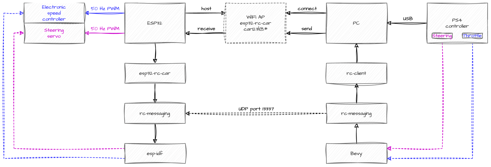

# rc-things

# status: working but very coupled to my own personal projects

My latest attempts at remote control stuff.

## Concept

Take a perfectly fine remote control device and over complicate it with things like ESP32s, STM32s and Raspberry Pis;
use as much Rust as possible because I'm trying to learn it.

## Approach

-   Run a client on a PC w/ a PS4 controller
-   It sends UDP messages to a vehicle
-   Vehicle converts the UDP messages into movement

## Components

-   `rc-messaging`
    -   Code for a universal messaging format that's worked for both my Ackerman steering and differential steering
        vehicles so far
    -   Code for a minimal UDP server / client to send the above messages client (remote control) -> server (vehicle)
    -   Uses [serde](https://crates.io/crates/serde) and [rmp-serde](https://crates.io/crates/rmp-serde) (MessagePack)
-   `rc-vehicle`
    -   Code to compose the above together with a tiny bit of safety to avoid runaway vehicles

## Implementations

-   `rc-client`
    -   Code for a workstation with a UI that reads from a PS4 controller and sends messages to a vehicle
    -   Uses [Bevy](https://bevyengine.org/) for the I/O
-   `esp32-rc-car`
    -   Code for an ESP32 microcontroller that runs a WiFi AP, receives UDP remote control messages and turns them into
        PWM signals
    -   Based on [esp-idf-template](https://github.com/esp-rs/esp-idf-template)
    -   Uses as much Rust standard library as possible
    -   Uses `rc-messaging` and `rc-vehicle`
-   `pi-rc-tank`
    -   Code for a Raspberry Pi that receives UDP remote control messages and turns them into serial remote control
        messages
    -   Uses Rust standard library and [Tokio](https://tokio.rs/)
    -   Uses `rc-messaging` and `rc-vehicle`
-   `stm32-rc-tank`
    -   Code for an STM32 microcontroller that is packaged as a [Husarion Core2](https://husarion.com/manuals/core2/),
        receives serial remote control messages and turns them into PWM signals
    -   Uses [hFramework](https://github.com/husarion/hFramework) C++ library (deprecated, but Core2 is coupled to it)

## Vehicles

### `esp32-rc-car`

-   [Hosim 9155](https://www.hosim.com/products/9155-blue)
    -   I already had this
-   [Hobbywing Quicrun WP brushed ESC](https://www.hobbywingdirect.com/products/quicrun-1080-esc-g2)
    -   I had to buy this because it turns out the factory ESC can't be decoupled from the receiver
-   [Hobbyking HK 3-wire servo](https://hobbyking.com/en_us/hobbykingtm-hk15178-analog-servo-1-4kg-0-09sec-10g.html)
    -   I already had this and needed to use it because the factory steering servo is 5-wire
        -   I guess this means the factory ESC also had the potentiometer handling circuitry in it?
-   [Traxxas Titan 12T 550 motor](https://traxxas.com/products/parts/motors/titan12T)
    -   I didn't need this initially but the factory motor ate some rocks and stopped working

#### Architecture

#### Wiring

### `pi-rc-tank` and `stm32-rc-tank`

-   [Husarion CORE2](https://husarion.com/manuals/core2/) (integrated STM32 and Raspberry Pi, seems to be Lego-compatible)
    -   I already had this and used it as a Linux computer with WiFi (the Pi) and a microcontroller (the STM32)
        -   So the responsibility of driving the tank is split between the two
-   [Altronics 2WD robot base](https://www.altronics.com.au/p/k1090-2wd-motorised-robot-building-base-kit/)
    -   I already had this and only used the 2 motors from it
-   [Lego-compatible tracked robot](https://www.amazon.com.au/Control-Tracked-Building-Educational-Learning/dp/B09CTT9F8N/)
    -   I already had this and used the tracks off it

#### Architecture

#### Wiring
